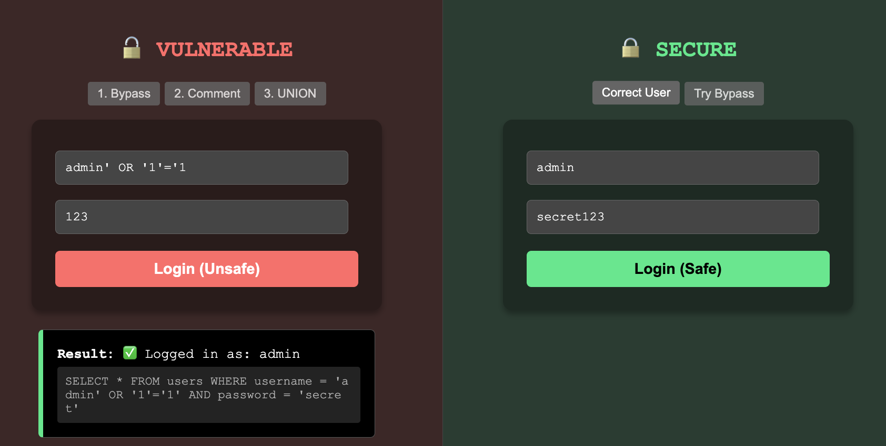
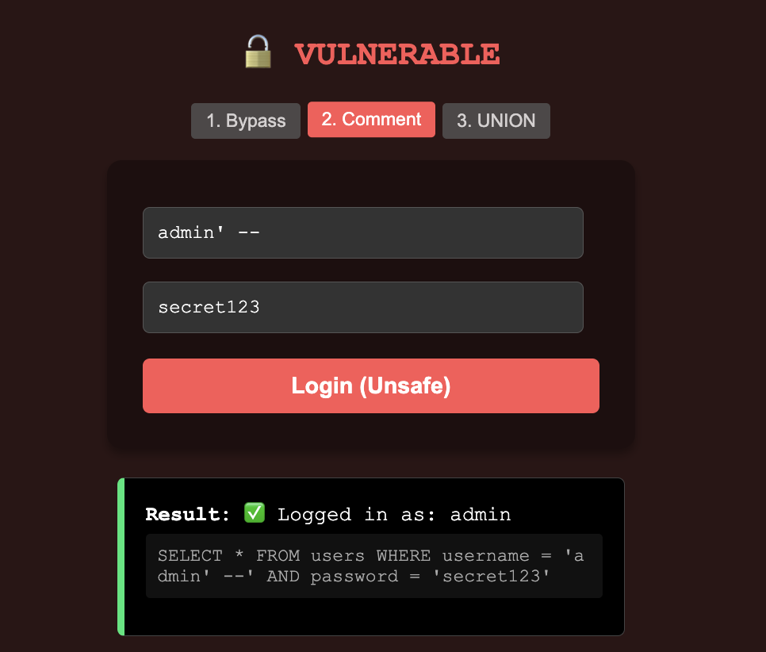
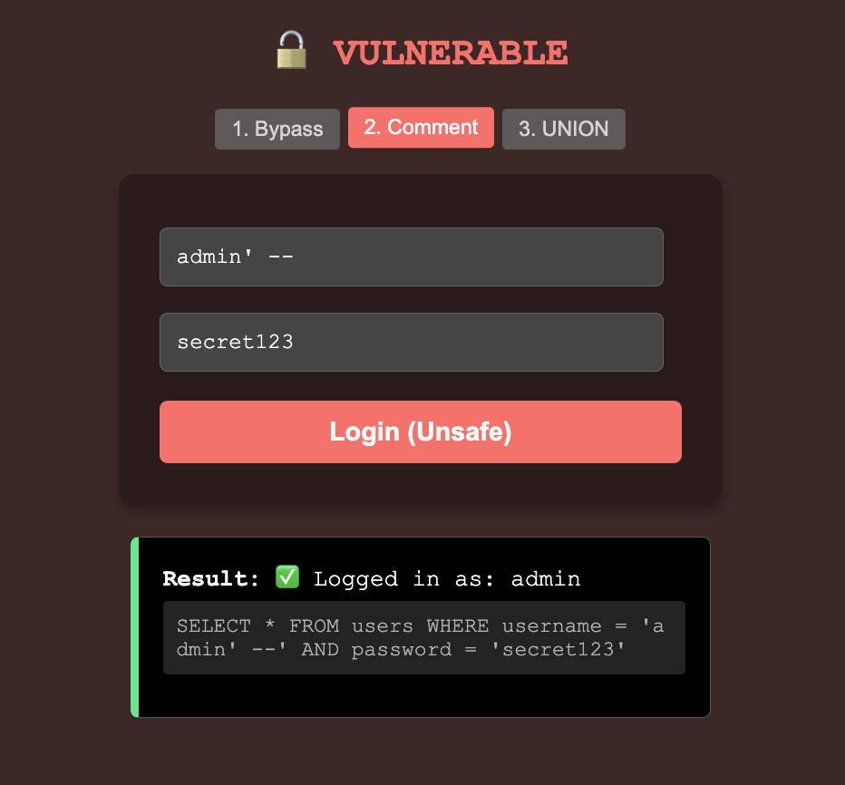
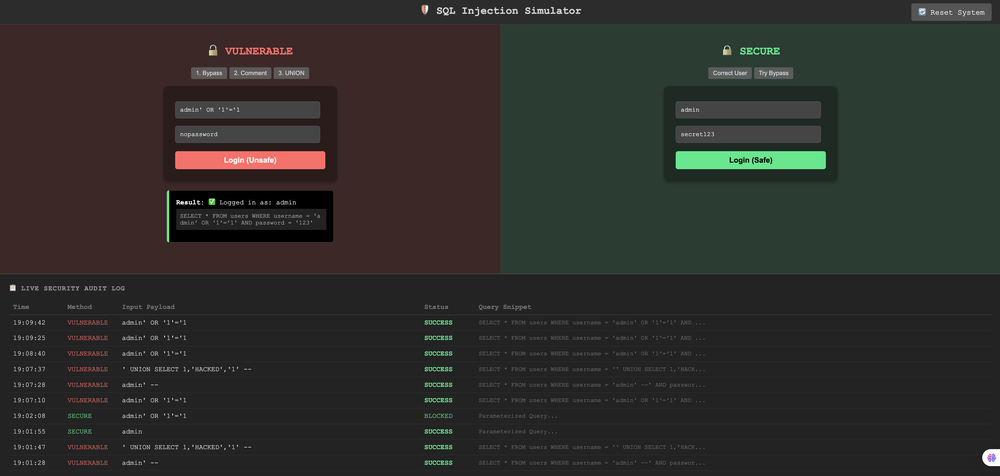
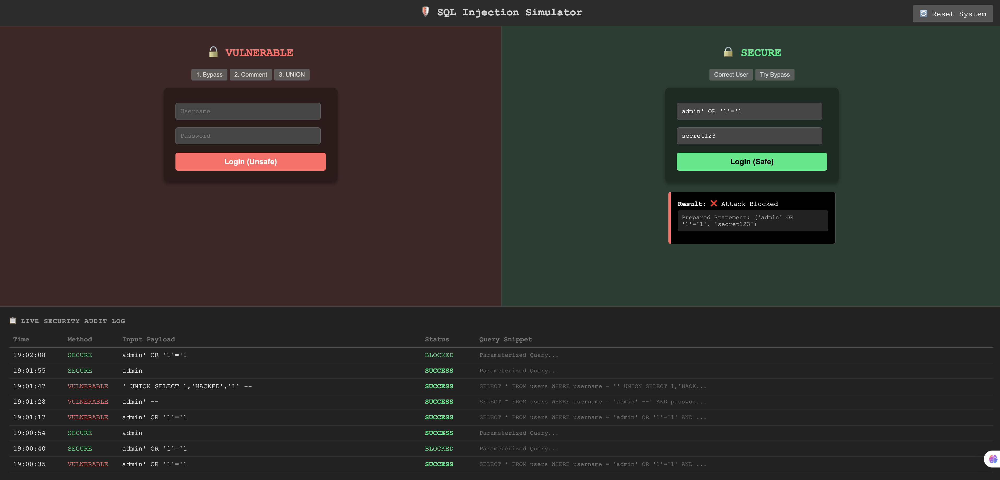
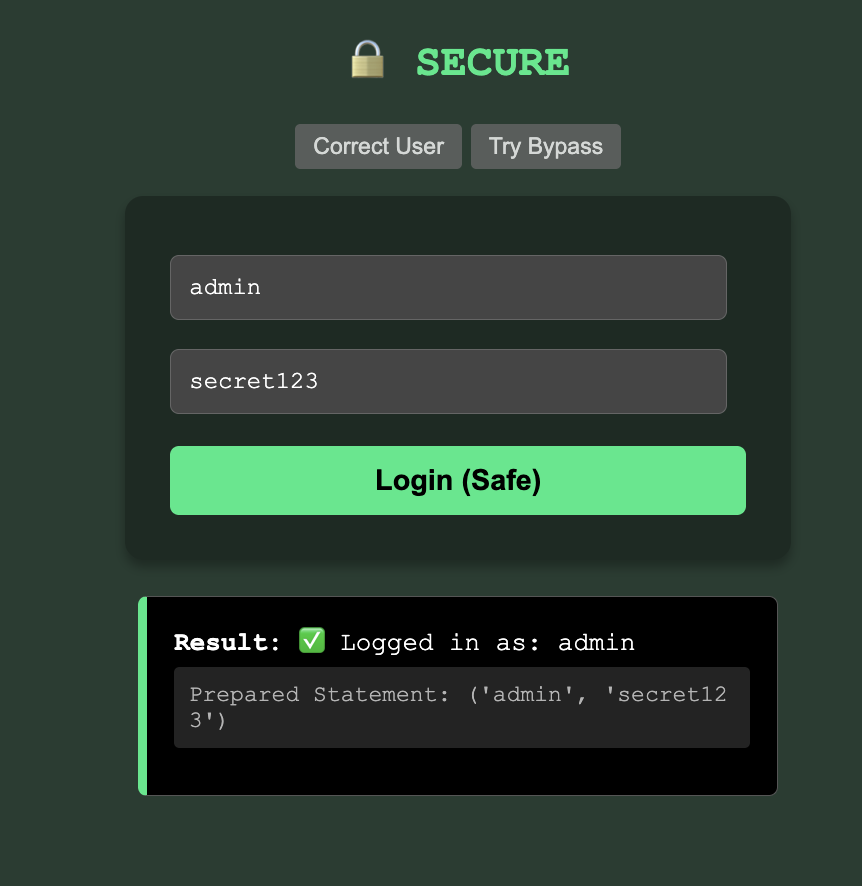
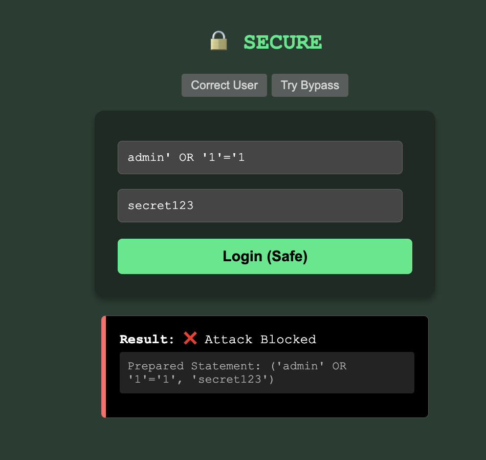

# 💉 SQL Injection Simulator & Mitigation Demo

A unified web dashboard designed to demonstrate **SQL Injection (SQLi)** attacks and their mitigation in real-time. 
This project contrasts a **Vulnerable Login** (susceptible to string concatenation injection) with a **Secure Login** (using Parameterized Queries).

## 🚀 Key Features

* **Live Attack Simulation:** Execute real SQLi payloads (`' OR '1'='1`) against a live SQLite database.
* **Side-by-Side Comparison:**
    * 🔴 **Vulnerable:** Uses `f-strings` to construct queries (Unsafe).
    * 🟢 **Secure:** Uses `cursor.execute(?, ?)` (Parameterized/Prepared Statements).
* **Interactive Dashboard (Bonus):**
    * **Quick Attack Buttons:** Pre-loaded payloads for instant demonstration.
    * **Live Audit Log:** Tracks all attempts, identifying the method (Vulnerable/Secure) and the result.

## 🛠️ Tech Stack

* **Backend:** Python (Flask)
* **Database:** SQLite3
* **Frontend:** HTML5, CSS3 (Dark Mode Dashboard)

## 📂 Project Structure

```text
SQL_Injection_Simulator/
│
├── app.py                 # Flask Application & Database Logic
├── requirements.txt       # Dependencies
├── README.md              # Documentation
└── templates/
    └── index.html         # Front-end Dashboard
```

## ⚙️ Installation & Usage
Install Dependencies:

Bash
pip install -r requirements.txt
Run the Server:

Bash
python app.py
Access the dashboard at http://127.0.0.1:5000

## ⚔️ Attack Scenarios
The dashboard allows you to simulate the following attacks:

Auth Bypass: admin' OR '1'='1 (Forces TRUE condition)

Comment Attack: admin' -- (Comments out password check)

UNION Injection: ' UNION SELECT... (Injects arbitrary data)

## 📸 Proof of Concept
1. Successful Attack (Vulnerable)
Injecting a tautology bypasses the password check instantly.

<details>
<summary>📸 <strong>Click to expand: View Successful Attack</strong></summary>








</details>

2. Attack Blocked (Secure)
Using Parameterized Queries treats the payload as a literal string, blocking the attack.

<details>
<summary>📸 <strong>Click to expand: View Mitigation</strong></summary>







</details>